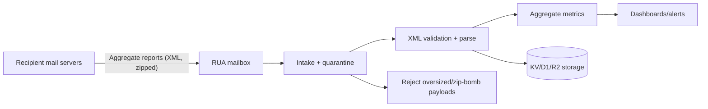

# Toppy's DMARC4all (DNS / Email Auth Quick Check)

Browser-only tool to quickly inspect a domain’s email authentication posture (DMARC/SPF/DKIM, plus related checks) using **public DNS only**.

This repo is a static site (HTML/CSS/JS). You can open it locally or publish it via GitHub Pages.

It also includes a DMARC RUA service description page and an operational workflow for managing the required external-destination authorization TXT records on Cloudflare.

## Branch / Release Policy

- Public repo: `main` is the only production branch.
- GitHub Pages deploys from `main` via `.github/workflows/pages.yml`.
- Releases are cut from `main` using annotated tags (for example: `v0.1.0`).
- Keep non-public or experimental work in a separate private remote/repo instead of a public `develop` branch.

## Features

- DMARC / SPF / DKIM quick checks (with evidence snippets)
- Optional: DNSBL sender-IP quick check (best-effort)
- Optional: BIMI lookup (`_bimi.<domain>`), parses `l=` (logo URL) and `a=`
- MTA-STS / TLS-RPT, MX, CAA, DNSSEC indicators, lightweight HTTPS probes
- Installable PWA shell for repeat use on desktop/mobile
- Multi-language UI (language selector)

## Privacy / Safety

- This tool does **not** send email and does **not** access mailboxes.
- It queries **public DNS** via DNS-over-HTTPS (DoH) endpoints.
- No server-side component: input is processed in your browser.
- Network requests go to:
  - DoH endpoints (selected in the UI; default: Cloudflare)
  - `rdap.org` (registrar lookup, public build only)
  - The checked domain itself for lightweight HTTPS reachability probes
  - (Optional) BIMI logo URL (only if it is `https://`)

## Usage

### Local

Option A (simplest): open `index.html` directly.

Option B (recommended): run a local static server.

```bash
cd DMARC4all
python3 -m http.server 8000
```

Then open:

- http://localhost:8000/

### GitHub Pages

1. Push this repository to GitHub.
2. Keep `main` as the default branch and production branch.
3. In GitHub: **Settings → Pages**
4. Set:
  - **Source**: “GitHub Actions”
5. Push to `main` (or run **Actions → Deploy static content to Pages** via `workflow_dispatch`).
6. After the workflow finishes, open the Pages URL shown in the deploy job (or in **Settings → Pages**).

Current public site: https://dmarc4all.toppymicros.com/

### PWA / install

- The public site can be installed as a PWA from supported browsers.
- The service worker caches the local app shell and translation assets for faster repeat visits.
- DNS lookups, RDAP lookups, and other live diagnostics still require network access and are not served from cache.

### Release

Create releases from `main` only.

```bash
git checkout main
git pull --ff-only origin main
git tag -a v0.1.0 -m "v0.1.0"
git push origin main --follow-tags
gh release create v0.1.0 --generate-notes
```

## DMARC RUA service

- Service page: `rua_service.html`
- Config (single source of truth): `rua_config.js` (customer-facing destination is injected at runtime)
- Translations: `i18n/rua_page.js`

### RUA service flow (Mermaid)



### Cloudflare DNS authorization TXT

Workflow: `.github/workflows/manage-rua-auth-txt.yml` (`workflow_dispatch`)

- Name: `<customer_domain>._report._dmarc.dmarc4all.toppymicros.com`
- Type: `TXT`
- Value: `v=DMARC1`

Required secrets:

- `CF_API_TOKEN`
- `CF_ZONE_ID`

The job is intended to be protected via the GitHub Environment `cloudflare-dns`.

### Recommended operations (safe, practical)

- Public repo: keep only Worker code, `public/index.html`, README, and templates (HTML/webloc).
- Secrets: GitHub Actions Secrets (CI) + Cloudflare Worker Secrets (production).
- Operational logs: keep in KV/D1/R2 (not in the repo).

### Mail receiving / storage

Mail receiving and R2 storage are handled on Cloudflare side.

## Notes / Limitations

- Results are best-effort. DNS responses can vary by resolver and network restrictions.
- DKIM “CNAME present” does not guarantee DKIM is actively signing/validating; confirm via real message headers.
- DNSBL checks are heuristic and may be blocked by your network.

## License

Apache License 2.0 (Apache-2.0). See `LICENSE`.

## Privacy notes (DoH)

This tool sends DNS queries for the entered domain to the selected DNS-over-HTTPS (DoH) provider. That provider may log and/or aggregate queries according to its policy. If you want to minimize third-party visibility, select a DoH endpoint you control in the UI, or modify the DoH provider list in `app.js`.

### Enterprise/offline build

- Entry points: `index_enterprise.html`, `rua_service_enterprise.html`
- External requests are limited to the selected DoH endpoint (no CDN/Google Fonts).
- RDAP lookups and external BIMI logo fetches are disabled to reduce third-party traffic.

## Docs

- Service/approach spec: `docs/service-spec.md`
