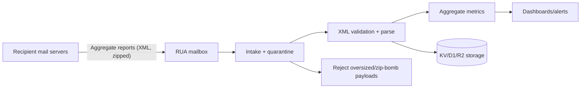

# Toppy's DMARC4all (DNS / Email Auth Quick Check)

Browser-only tool to quickly inspect a domain’s email authentication posture (DMARC/SPF/DKIM, plus related checks). The default diagnosis uses **public DNS only**; public RDAP and HTTPS reference checks require an explicit opt-in.

This repo is a static site (HTML/CSS/JS). You can open it locally or publish it via GitHub Pages.

It also includes a DMARC RUA service description page and an operational workflow for managing the required external-destination authorization TXT records on Cloudflare.

## Branch / Release Policy

- Public repo: `main` is the only production branch.
- GitHub Pages deploys from `main` via `.github/workflows/pages.yml`.
- Releases are cut from `main` using annotated tags (for example: `v0.1.0`); pushing a version tag starts the Release workflow.
- Keep non-public or experimental work in a separate private remote/repo instead of a public `develop` branch.

## Features

- DMARC / SPF / DKIM quick checks (with evidence snippets)
- RFC 9989 DMARC policy discovery with bounded DNS Tree Walk, requested/effective policy, and policy-source provenance
- Browser-local Header / `.eml` Analyzer for reported SPF, DKIM, DMARC, ARC, and message-path evidence
- Browser-local RFC 9990 RUA Analyzer for XML, gzip, ZIP, and multiple aggregate reports
- Evidence-backed reject-policy readiness decisions that keep insufficient evidence separate from known risk
- CLI and composite GitHub Action for checks, local evidence analysis, snapshots, and regression detection
- SPF/DKIM authentication supply-chain graph with declared, observed, and unresolved evidence separated
- Optional: DNSBL sender-IP quick check (best-effort)
- Optional: BIMI lookup (`_bimi.<domain>`), parses `l=` (logo URL) and `a=`; retrieving those HTTPS resources requires public-build opt-in
- MTA-STS / TLS-RPT, MX, CAA, DNSSEC indicators, plus opt-in lightweight HTTPS reference probes in the public build
- Installable PWA shell for repeat use on desktop/mobile
- Multi-language UI (language selector)

## Privacy / Safety

- This tool does **not** send email and does **not** access mailboxes.
- Header and `.eml` inputs are parsed locally with a 1 MiB input limit; no message content is uploaded or stored by this static site.
- Header Analyzer results distinguish reported receiver evidence from independent verification. It does not cryptographically revalidate DKIM signatures.
- RUA reports are parsed locally with 10 MiB compressed, 50 MiB expanded, 20-file, and 100,000-record limits. DTDs, entities, and unsafe archives are rejected.
- Duplicate RUA report identities are counted once, conflicting duplicates are rejected, and readiness correlation requires the report policy domain to match the diagnosis policy source.
- The default diagnosis queries **public DNS only** via the selected DNS-over-HTTPS (DoH) endpoint.
- In the public build, a separate unchecked option can enable public RDAP and HTTPS reference checks for that diagnosis.
- No server-side component: input is processed in your browser.
- Network requests go to:
  - The DoH endpoint selected in the UI (default: Cloudflare)
  - With explicit public-build opt-in: `rdap.org` and the registry RDAP service to which it redirects, the checked domain and its `www` / `mta-sts` hosts, and HTTPS BIMI `l=` / `a=` URLs
- Checked-domain and BIMI probes do not follow redirects. The `rdap.org` bootstrap request follows its registry-RDAP redirect so that the lookup can complete.
- The enterprise/offline entry point disables the optional RDAP and HTTPS requests; its diagnosis traffic is limited to the selected DoH endpoint.

## Standards & operational guidance

- Standards and privacy position: https://dmarc4all.toppymicros.com/standards_privacy.html
- DNS provider setup notes: https://dmarc4all.toppymicros.com/dns_provider_guides.html
- IETF DMARC watch: track DMARCbis, DMARC Aggregate Reporting, and DMARC Failure Reporting; separate standards guidance from provider-specific behavior when they differ.
- IETF/WG sharing position: the default diagnosis is a public-DNS-only implementation aid, with separately opted-in public reference checks; it is not a replacement for the specifications or a receiver-side conformance test. Feedback is especially useful on wording accuracy, RUA/RUF privacy guidance, and enforcement-readiness criteria.

## AI and machine access

- Curated LLM index: https://dmarc4all.toppymicros.com/llms.txt
- Detailed machine context: https://dmarc4all.toppymicros.com/llms-full.txt
- AI usage and safety guidance: https://dmarc4all.toppymicros.com/ai_usage.html
- Portable diagnosis schema 1.3.0: https://dmarc4all.toppymicros.com/schemas/diagnosis-result-1.3.0.schema.json
- Compatibility schema index: https://dmarc4all.toppymicros.com/schemas/diagnosis-result.schema.json
- Example diagnosis report: https://dmarc4all.toppymicros.com/examples/diagnosis-result.example.json
- Example RFC 9990 RUA report: `examples/rua-report.example.xml`

The browser's JSON export uses the versioned `dmarc4all-diagnosis` format and omits presentation HTML. It separates observations, readiness, remediation, evidence, limitations, and errors so automated consumers do not need to scrape the results page.

DMARC4all does not currently expose a public diagnosis API or MCP endpoint. Suggested records are review drafts and must not be applied automatically.

## Usage

### Local

Option A (simplest): open `index.html` directly.

Option B (recommended): run a local static server.

```bash
cd DMARC4all
python3 -m http.server 8000
```

Then open:

- http://localhost:8000/

### GitHub Pages

1. Push this repository to GitHub.
2. Keep `main` as the default branch and production branch.
3. In GitHub: **Settings → Pages**
4. Set:
  - **Source**: “GitHub Actions”
5. Push to `main` (or run **Actions → Deploy static content to Pages** via `workflow_dispatch`).
6. After the workflow finishes, open the Pages URL shown in the deploy job (or in **Settings → Pages**).

Current public site: https://dmarc4all.toppymicros.com/

### PWA / install

- The public site can be installed as a PWA from supported browsers.
- The service worker caches the local app shell and translation assets for faster repeat visits.
- If the shell is opened without connectivity, it falls back to `offline.html` and explains that live DNS and explicitly enabled RDAP/HTTPS checks still need network access.
- When a new shell is available, the app shows an in-page reload prompt instead of silently staying on an old cache.
- DNS lookups and any explicitly enabled RDAP/HTTPS checks still require network access and are not served from cache.

### Release

Create releases from `main` only. Replace `<tag>` with the next reviewed version. Pushing the annotated tag starts `.github/workflows/release.yml`, which verifies the tag and creates the GitHub Release with generated notes. The manual workflow dispatch is only for creating a release from an existing tag.

```bash
git checkout main
git pull --ff-only origin main
git tag -a <tag> -m "<tag>"
git push origin main
git push origin <tag>
```

Wait for the Release workflow to finish, then verify the published release. If curated notes are required, update the workflow-created release with `gh release edit <tag> --notes-file <notes-file>`; do not run a second `gh release create`.

### Test

Run the lightweight regression suite with:

```bash
npm test
```

This runs:

- Node built-in tests for the extracted JS modules
- Python `unittest` coverage for the Cloudflare TXT management script

### CLI

The CLI requires Node.js 20.18.0 or newer. Install the locked dependencies with `npm ci --ignore-scripts` before use.

Run the repository-local CLI with Node.js:

```bash
npm run dmarc4all -- check example.com --json
npm run dmarc4all -- header message.eml --json
npm run dmarc4all -- rua report.xml.gz --json
npm run dmarc4all -- readiness --diagnosis diagnosis.json report.xml.gz --json
npm run dmarc4all -- snapshot example.com --selector selector1 --output before.json
npm run dmarc4all -- diff before.json after.json --fail-on high --json
```

Exit codes are `0` for a completed command without a configured failure, `1` for invalid input or an operational error, and `2` when `--fail-on` matches a finding. `--fail-on` accepts only `low`, `med`, or `high`. CLI JSON identifies the immutable `schemas/cli-output-1.0.0.schema.json` contract; `schemas/cli-output.schema.json` is the compatibility index. Outputs are validated with a Draft 2020-12 validator before they are written.

`check` and `snapshot` query the configured public DNS-over-HTTPS resolver. Header and RUA contents are read locally. `snapshot` also checks the MTA-STS HTTPS policy unless `--no-http` is supplied. No command changes DNS or provider settings.

### GitHub Action

The composite action at `.github/actions/dmarc4all/action.yml` accepts `domain`, `fail-on`, optional comma-separated `selectors`, and an optional DNS-over-HTTPS `resolver`. Public workflows should pin a reviewed release tag rather than `main`:

```yaml
- uses: ToppyMicroServices/DMARC4all/.github/actions/dmarc4all@v0.4.2
  with:
    domain: example.com
    fail-on: high
    selectors: selector1,selector2
```

The action emits annotations for DMARC, SPF lookup-limit, and requested DKIM-selector findings. It returns the generated JSON path as the `report` output even when a configured finding threshold exits with code 2. The default resolver is Cloudflare's public DNS-over-HTTPS JSON endpoint; no secrets are required.

### Readiness decisions

The readiness model returns `READY`, `CONDITIONALLY_READY`, `NOT_READY`, or `INSUFFICIENT_EVIDENCE`, with evidence references for each reason. Its default gates—100 observed messages, seven observation days, 98% aligned traffic, at most 5% unknown traffic, and at most 20% SPF-only aligned traffic—are configurable product heuristics, not RFC requirements. Review the retained evidence and organizational risk before changing a DMARC policy.

### Authentication graph

Open `authentication_graph.html` to visualize SPF dependencies, DKIM selectors, header evidence, and RUA observations. Load portable diagnosis JSON directly, or download graph JSON from the Header and RUA analyzers and select the exports together. The graph and its accessible table merge identical domains while retaining declared, observed, or unresolved evidence states; it does not infer a sending provider from an IP address or authentication domain. Structural node, edge, SPF-depth, term, report, and record limits bound rendering work.

## Security

See `SECURITY.md` for the supported-version policy, private reporting route, trust boundaries, and review invariants.

## DMARC RUA service

- Service page: `rua_service.html`
- Config (single source of truth): `rua_config.js` (customer-facing destination is injected at runtime)
- Translations: `i18n/rua_page.js`

### RUA service flow (Mermaid)


```mermaid
flowchart LR
  A[Recipient mail servers] -- Aggregate reports (XML, zipped) --> B[RUA mailbox]
  B --> C[Intake + quarantine]
  C --> D[XML validation + parse]
  D --> E[Aggregate metrics]
  E --> F[Dashboards/alerts]
  D --> G[(KV/D1/R2 storage)]
  C --> H[Reject oversized/zip-bomb payloads]
```

### Cloudflare DNS authorization TXT

Workflow: `.github/workflows/manage-rua-auth-txt.yml` (`workflow_dispatch`)
Implementation script: `.github/scripts/manage_rua_auth_txt.py`

- Name: `<customer_domain>._report._dmarc.dmarc4all.toppymicros.com`
- Type: `TXT`
- Value: `v=DMARC1`

Required secrets:

- `CF_API_TOKEN`
- `CF_ZONE_ID`

The job is intended to be protected via the GitHub Environment `cloudflare-dns`.

### Recommended operations (safe, practical)

- Public repo: keep only Worker code, `public/index.html`, README, and templates (HTML/webloc).
- Secrets: GitHub Actions Secrets (CI) + Cloudflare Worker Secrets (production).
- Operational logs: keep in KV/D1/R2 (not in the repo).

### Mail receiving / storage

Mail receiving and R2 storage are handled on Cloudflare side.

## Notes / Limitations

- Results are best-effort. DNS responses can vary by resolver and network restrictions.
- DKIM “CNAME present” does not guarantee DKIM is actively signing/validating; confirm via real message headers.
- DNSBL checks are heuristic and may be blocked by your network.

## License

Apache License 2.0 (Apache-2.0). See `LICENSE`.

## Privacy notes (DoH)

This tool sends DNS queries for the entered domain to the selected DNS-over-HTTPS (DoH) provider. That provider may log and/or aggregate queries according to its policy. If you want to minimize third-party visibility, select a DoH endpoint you control in the UI, or modify the DoH provider list in `app.js`. The public build sends RDAP or HTTPS reference requests only after the separate option is explicitly enabled for a diagnosis. An opted-in `rdap.org` request can redirect to the responsible registry's public RDAP service.

### Enterprise/offline build

- Entry points: `index_enterprise.html`, `rua_service_enterprise.html`
- External requests are limited to the selected DoH endpoint (no CDN/Google Fonts).
- RDAP, checked-domain HTTPS probes, and external BIMI `l=` / `a=` fetches are disabled.

## Code Layout

- `src/core.js`: UI wiring, resolver selection, and submit flow
- `src/authentication-core.js`: UI-independent DMARC discovery, normalized authentication evidence, and enforcement-readiness decisions
- `src/message-analysis.js`: bounded browser-local header/EML parsing and reported-evidence normalization
- `src/rua-analysis.js`: bounded RFC 9990 and legacy aggregate-report parsing and aggregation
- `src/automation.js`: versioned snapshots and security-relevant diffs
- `src/authentication-graph.js`: evidence-separated SPF/DKIM graph model
- `bin/dmarc4all.js`: CLI entry point
- `src/diagnose.js`: main diagnosis runner/orchestration
- `src/diagnostics.js`: DNS/network/protocol helper functions
- `src/render.js`: findings, report sections, exports, and DNSBL rendering
- `src/portable-report.js`: stable machine-readable diagnosis export
- `src/i18n.js`: translation state and helpers

## Docs

- Service/approach spec: `docs/service-spec.md`
- Phased implementation roadmap: `docs/roadmap.md`
